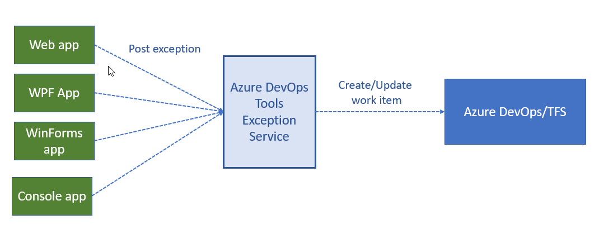

# AzureDevOpsTools.ExceptionReporter

Getting information about failures and unhandled exceptions from your applications running in the wild is critical. You need as much information as possible about the actual failure, and then you need a process to make sure that this particular error is fixed, deployed and not reappearing again later on.

We believe the best option to track and fix application exceptions is by using a work item tracking system, like Azure DevOps (formerly known as VSTS). This open source projecs is about making it as easy as possible to collect all necessary error information from unhandled exceptions in your applications, and posting them to your Azure DevOps (or TFS) accounts where the information will be stored in a work item of your choice. If the same exception happens multiple times, we will not create a new work item every time, but instead update an existing one. 

